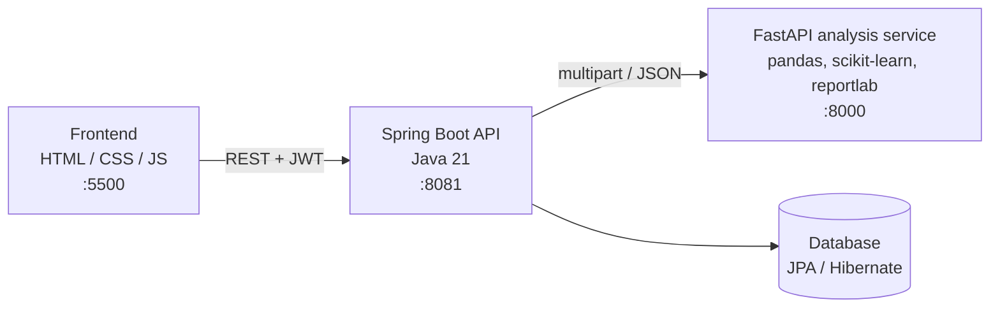

# DataHub

**A mini Kaggle + data management platform.** Upload a dataset, get an automatic analysis (statistics, data quality, machine learning, charts) and export the whole result as a single PDF report.

> Educational / portfolio project.

<!-- Add screenshots to docs/screenshots/ and uncomment:


-->

## Features

- **Authentication & roles**: register / login with JWT, BCrypt-hashed passwords, `USER` and `ADMIN` dashboards
- **Upload** CSV, Excel (`.xlsx`, `.xls`) and JSON files
- **Data preview**: first 10 rows, column names and types
- **Data quality report**: missing values, duplicates, per-column stats, outliers (IQR method)
- **Analysis**: descriptive statistics and K-Means clustering (Stats / ML / Both)
- **Charts**: histogram, scatter plot, box plots, correlation heatmap
- **Export**: full **PDF report** (stats + quality + ML + charts) and CSV tables (stats, quality, outliers, clusters), generated from the analysis already stored, with no re-upload
- **History**: every analysis is saved, searchable, filterable by status and re-openable
- **Compare** two analyses side by side
- **Admin dashboard**: list of users and all stored data

## Architecture



| Component | Tech | Port |
|---|---|---|
| Frontend | HTML, CSS, vanilla JS, Chart.js | 5500 |
| Backend API | Spring Boot 4, Java 21, Maven, JPA/Hibernate, JWT | 8081 |
| Analysis service | Python, FastAPI, pandas, scikit-learn, reportlab | 8000 |

The backend handles auth, persistence and history. All heavy data work (analysis, ML, PDF/CSV generation) lives in the Python microservice.

## Project structure

```
DataHub Platform/
├── datahub/                     # Spring Boot backend + frontend
│   ├── pom.xml
│   ├── src/main/java/com/datahub/
│   │   ├── config/
│   │   ├── controller/          # AnalysisController, ExportController, ...
│   │   ├── dto/
│   │   ├── entity/              # AnalysisJob, ...
│   │   ├── repository/
│   │   └── service/             # AnalysisService (talks to the Python service)
│   ├── src/main/resources/
│   └── frontend/                # index, auth, dashboards (user / admin)
└── python-analysis-service/
    ├── main.py                  # FastAPI endpoints
    ├── report.py                # PDF / CSV report builder
    └── requirements.txt
```

## Getting started

### Prerequisites

- Java 21 and Maven (or an IDE such as VS Code / IntelliJ)
- Python 3.12+ (tested on 3.14)
- A database supported by JPA/Hibernate

### 1. Configure the backend

Create `datahub/src/main/resources/application.properties` (it is git-ignored, so use your own values):

```properties
server.port=8081

# Database
spring.datasource.url=jdbc:<your-database-url>
spring.datasource.username=<user>
spring.datasource.password=<password>
spring.jpa.hibernate.ddl-auto=update

# Python analysis service
python.service.url=http://localhost:8000

# Also add your JWT secret / expiration keys here, matching the names your code reads.
```

For production, use environment variables with **no fallback defaults** (e.g. `${DB_URL}`), so the app fails fast when one is missing.

### 2. Start the analysis service (port 8000)

```powershell
cd python-analysis-service
python -m venv venv
venv\Scripts\activate
pip install --only-binary :all: -r requirements.txt
uvicorn main:app --reload --port 8000
```

> On Python 3.14 (Windows), `--only-binary :all:` is required because only recent package versions ship pre-built wheels.

Interactive API docs: <http://localhost:8000/docs>

### 3. Start the backend (port 8081)

```powershell
cd datahub
mvn spring-boot:run
```

(or run the `@SpringBootApplication` class from your IDE)

### 4. Start the frontend (port 5500)

```powershell
cd datahub\frontend
python -m http.server 5500
```

Open <http://localhost:5500> → **Get Started** → create an account → upload a dataset.

## API overview

### Backend (`:8081`)

| Method | Endpoint | Description |
|---|---|---|
| POST | `/api/users/register` | Create an account |
| POST | `/api/users/login` | Login, returns a JWT and the role |
| GET / POST | `/api/data/my`, `/api/data` | Personal records |
| GET | `/api/data/all`, `/api/admin/users` | Admin only |
| POST | `/api/analysis/upload` | Upload a file and run the analysis |
| POST | `/api/analysis/preview` | Preview a file |
| POST | `/api/analysis/quality-report` | Data quality report |
| GET | `/api/analysis/history` | Analyses of the current user |
| GET | `/api/analysis/{id}/export/pdf` | Full PDF report |
| GET | `/api/analysis/{id}/export/csv?type=stats\|quality\|outliers\|clusters` | CSV export |

All endpoints except register / login require `Authorization: Bearer <token>`.

### Analysis service (`:8000`)

`GET /health`, `POST /preview`, `POST /quality-report`, `POST /analyze`, `POST /export-pdf`, `POST /export-csv`

## Roadmap

- [ ] Store uploaded files so the preview works from the history
- [ ] ML feature selection
- [ ] Batch processing of several files
- [ ] Docker Compose for the 3 services
- [ ] Automated tests

## Author

Built by **Aya**.
